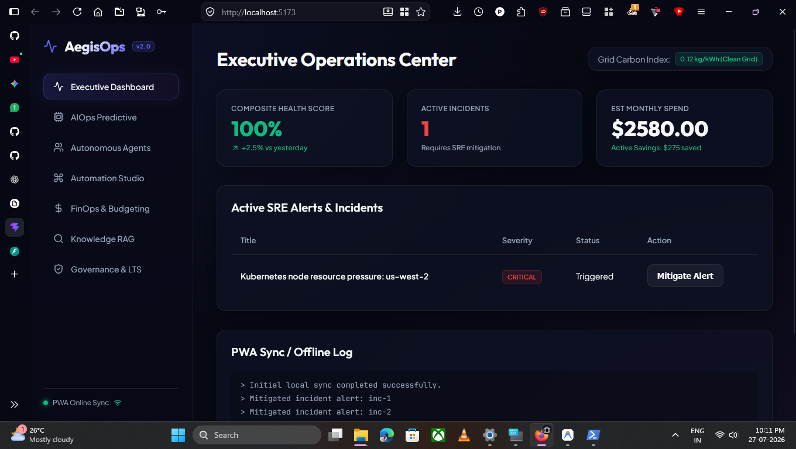
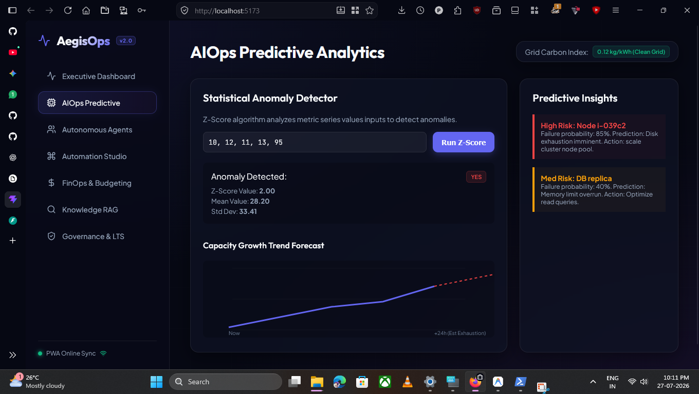
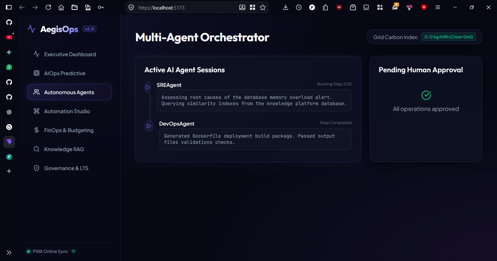
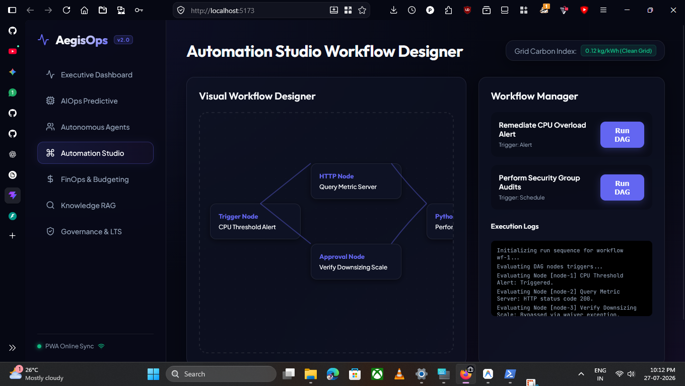
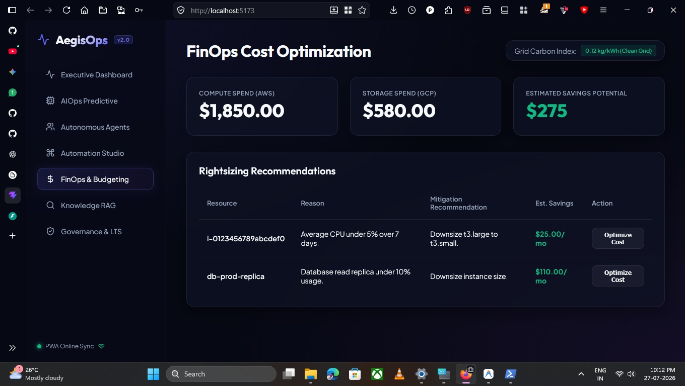
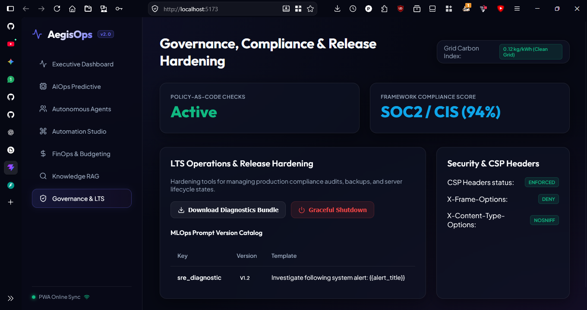
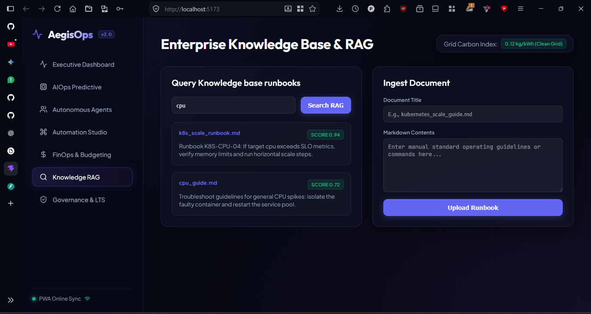

<div align="center">

# 🚀 AegisOps
### Enterprise AI-Powered DevOps & AIOps Platform

<p>
An intelligent DevOps platform that combines <b>AIOps</b>, <b>DevSecOps</b>, <b>FinOps</b>, <b>MLOps</b>, <b>Infrastructure Automation</b>, and <b>AI Agents</b> into a single enterprise-grade solution.
</p>


</div>

---

# 📖 Overview

AegisOps is an enterprise-scale AI-powered DevOps platform designed to simplify modern cloud operations.

Instead of using multiple disconnected tools, AegisOps provides one unified platform for:

- Infrastructure Monitoring
- AI Incident Detection
- Root Cause Analysis
- Intelligent Automation
- DevSecOps
- FinOps
- MLOps
- Enterprise Dashboards
- Knowledge Base (RAG)
- AI Agents
- Multi-Cloud Operations

---

# ✨ Features

## 🤖 AI Operations

- AI Incident Detection
- Root Cause Analysis
- Predictive Analytics
- Intelligent Alert Correlation
- Self-Healing Automation
- AI Recommendations

---

## 📊 Enterprise Dashboards

- Executive Dashboard
- Operations Dashboard
- Security Dashboard
- FinOps Dashboard
- AI Insights
- Real-time Monitoring

---

## 🔐 DevSecOps

- Security Scanning
- Compliance Monitoring
- Policy as Code
- Secret Detection
- SBOM Generation
- Security Reports

---

## 💰 FinOps

- Cost Analytics
- Budget Tracking
- Rightsizing
- Idle Resource Detection
- Forecasting
- Carbon Footprint Analysis

---

## ☁ Multi Cloud

Supports future integrations with:

- AWS
- Azure
- Google Cloud
- Kubernetes
- Docker
- Terraform

---

## 🧠 AI Knowledge Platform

- Enterprise Knowledge Base
- Retrieval-Augmented Generation (RAG)
- Vector Search
- AI Memory
- Context Builder

---

## 🤖 AI Agents

- Autonomous AI Agents
- Multi-Agent Collaboration
- Workflow Planning
- Automated Remediation
- Human Approval Workflows

---

# 🏗 Architecture

```
                    +----------------------+
                    |      Frontend        |
                    | React + TypeScript   |
                    +----------+-----------+
                               |
                    REST / WebSocket APIs
                               |
+---------------------------------------------------------+
|                 FastAPI Backend                         |
|---------------------------------------------------------|
| AI Hub | AIOps | DevSecOps | FinOps | MLOps | RAG | API |
+---------------------------------------------------------+
                               |
+---------------------------------------------------------+
| PostgreSQL | Redis | Vector DB | Docker | Kubernetes    |
+---------------------------------------------------------+
```

---

# 📂 Project Structure

```
AegisOps
│
├── assets/
│   └── screenshots/
│
├── backend/
│
├── frontend/
│
├── docs/
│
├── deploy/
│
├── README.md
│
└── .gitignore
```

---

# 📸 Screenshots

## Executive Dashboard



---

## AI Operations



---

## AI Agents



---

## Automation



---

## FinOps



---

## Governance



---

## Enterprise RAG



---

# 🛠 Technology Stack

### Backend

- Python
- FastAPI
- SQLAlchemy
- PostgreSQL
- Redis

### Frontend

- React
- TypeScript
- Vite

### DevOps

- Docker
- Kubernetes
- Helm
- GitHub Actions

### AI

- OpenAI
- Ollama
- RAG
- AI Agents

---

# 🚀 Getting Started

## Clone Repository

```bash
git clone https://github.com/Padmesh010/AegisOps.git
```

```bash
cd AegisOps
```

---

## Backend

```bash
cd backend
```

```bash
pip install -r requirements.txt
```

```bash
uvicorn app.main:app --reload
```

---

## Frontend

```bash
cd frontend
```

```bash
npm install
```

```bash
npm run dev
```

---

# 📚 Documentation

Project documentation is available inside the **docs/** directory.

- Architecture
- ADRs
- Design System
- Disaster Recovery
- Walkthrough

---

# 🗺 Roadmap

- [x] Backend Foundation
- [x] AI Hub
- [x] Authentication
- [x] Monitoring
- [x] Incident Detection
- [x] Root Cause Analysis
- [x] Automation
- [x] DevSecOps
- [x] FinOps
- [x] MLOps
- [x] RAG
- [x] AI Agents
- [ ] Multi-Cloud Integrations
- [ ] Plugin Marketplace
- [ ] Enterprise Mobile App

---

# 🤝 Contributing

Contributions, feature requests, and suggestions are welcome.

1. Fork the repository
2. Create a feature branch
3. Commit your changes
4. Submit a Pull Request

---

# 📄 License

This project is licensed under the MIT License.

---

<div align="center">

## ⭐ If you like this project, consider giving it a Star!

Built with ❤️ using Python, FastAPI, React, and AI.

</div>