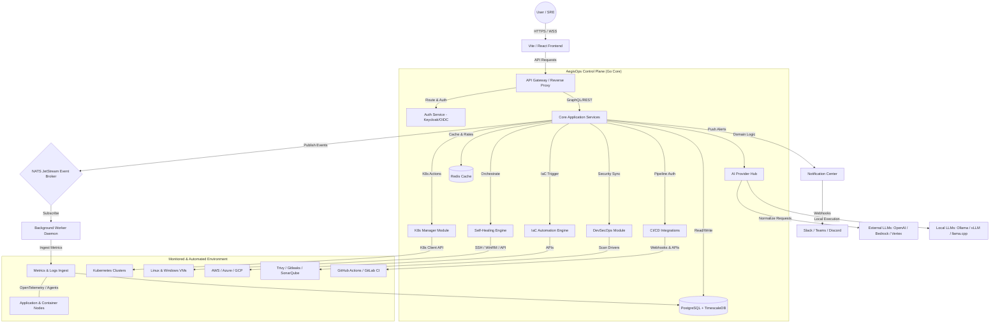

# AegisOps: Master Project Blueprint (SRS & System Architecture)
## Enterprise Edition v1.0
### Tagline: Observe • Analyze • Heal • Secure • Automate

---

## 1. Executive Summary

AegisOps is an enterprise-grade, AI-Powered DevOps Platform designed to consolidate the fragmented landscape of observability, automation, cloud management, DevSecOps, and intelligent operations. In modern enterprise environments, engineering teams are forced to context-switch between disparate tools (e.g., Datadog for monitoring, ArgoCD for deployments, Jira for incident management, and external LLM portals for troubleshooting). AegisOps unifies these capabilities into a single control plane.

By integrating real-time system monitoring, automated anomaly detection, AI-driven incident analysis, self-healing orchestration, and native Kubernetes management, AegisOps reduces Mean Time to Detection (MTTD) and Mean Time to Resolution (MTTR). The platform is engineered with a modular, cloud-native, and security-first architecture, ensuring scalability across multi-cloud and hybrid environments. This document serves as the foundational Software Requirements Specification (SRS) and System Architecture Blueprint for the development of AegisOps.

---

## 2. Vision & Objectives

### 2.1. Product Vision
The core vision of AegisOps is to move from passive observability to active, self-healing, and secure cloud operations. Traditional monitoring alerts operators of failures; AegisOps not only alerts but uses local or cloud-hosted AI to explain *why* the failure occurred and executes automated, pre-approved runbooks to *heal* the system.

```
       +---------------------------------------------+
       |                  OBSERVE                    |
       |  Prometheus / OpenTelemetry / Cloud APIs    |
       +----------------------++---------------------+
                              ||
                              \/
       +---------------------------------------------+
       |                  ANALYZE                    |
       |      AI Incident Engine (Log/Metric LLM)    |
       +----------------------++---------------------+
                              ||
                              \/
       +---------------------------------------------+
       |            HEAL / SECURE / AUTOMATE         |
       |    Kubernetes / IaC / DevSecOps Scanning    |
       +---------------------------------------------+
```

### 2.2. Core Objectives
*   **Zero-Trust Observability**: Secure agentless and agent-based ingestion of logs, metrics, and traces.
*   **AI Democratization (Provider Agnostic)**: Decouple business logic from specific AI models, allowing seamless hot-swapping between offline local models (e.g., Ollama, vLLM) and commercial APIs (e.g., Anthropic, OpenAI).
*   **Autonomous Remediation (Self-Healing)**: Enable safe, rule-bounded closed-loop automation to mitigate recurring operational incidents without human intervention.
*   **Integrated DevSecOps**: Inject security scanning, secret detection, and vulnerability assessments directly into the operator's daily cockpit.
*   **Open Standards Adherence**: Avoid vendor lock-in by designing around CNCF (Cloud Native Computing Foundation) standards like OpenTelemetry, Kubernetes APIs, and OpenTofu/Terraform.

---

## 3. User Personas & Roles

AegisOps enforces a strict Role-Based Access Control (RBAC) model. The table below outlines the target user personas, their primary responsibilities, and their access scopes.

| Persona | Title | Core Responsibilities | Platform Access & Permissions | Typical Workflow |
| :--- | :--- | :--- | :--- | :--- |
| **Super Administrator** | Global Owner | Full platform management, billing, compliance auditing, system-wide configuration. | Read/Write/Execute across all modules, tenants, and system settings. | Configure global SSO, manage license keys, audit security logs. |
| **Platform Administrator** | Platform Engineer | Managing infrastructure clusters, setting up integrations, configuring global self-healing policies, onboarding tenants. | Read/Write on infrastructure, integrations, and RBAC settings; No raw financial billing access. | Register a new Kubernetes cluster, configure the Slack notification gateway, update the Ollama endpoint. |
| **DevOps Engineer** | System Builder | Creating CI/CD pipelines, writing infrastructure as code, configuring application-specific self-healing rules. | Read/Write on CI/CD, IaC, and monitoring; Execute rights on manual healing triggers. | Analyze container vulnerability scan reports, write an Ansible/Terraform block, adjust pod memory limits. |
| **Site Reliability Engineer (SRE)** | System Guard | Maintaining system uptime, defining SLAs/SLOs, managing incident response, running AI analysis on outages. | Read on all modules; Write/Execute on incident management, runbooks, and cluster operations. | Acknowledge a high-memory alert, execute a pod restart via the UI, trigger an AI analysis of log stack traces. |
| **Cloud Engineer** | Infra Specialist | Allocating cloud resources, managing VMs and multi-cloud network endpoints. | Read/Write on Cloud Infrastructure and IaC modules. | Inspect AWS/Azure spending metrics, provision a new database node via visual IaC builder. |
| **Kubernetes Administrator** | K8s Specialist | Maintaining cluster health, updating Helm charts, auditing pod states. | Read/Write on K8s Manager; Read-only on AI and CI/CD. | Debug a `CrashLoopBackOff`, inspect configmaps, verify ingress controllers. |
| **Security Engineer** | SecOps Specialist | Vulnerability management, checking for leaked secrets, auditing compliance reports, reviewing access logs. | Read-only on infrastructure; Write/Execute on DevSecOps and Audit Logs. | Run a Checkov scan on a new Terraform template, review Trivy container vulnerabilities, inspect system audit logs. |
| **Software Developer** | Application Owner | Monitoring service health, checking deployment status, troubleshooting application logs. | Read-only on cluster infra; Read/Write on service-specific logs, metrics, and CI/CD pipelines. | Push code to trigger a GitHub action, view live logs of a service, request AI analysis for a localized application error. |
| **Auditor** | Compliance Officer | Checking system configuration drift, user access logs, and security compliance certificates. | Read-only access to Audit Logs, Git History, DevSecOps reports, and SLA metrics. | Export PDF compliance reports, verify that all production access requests match authorized ticket IDs. |
| **Read-Only Viewer** | Stakeholder | Monitoring overall system status dashboards without administrative capabilities. | Read-only access to Dashboards, Reporting, and Analytics. | View the high-level SLA dashboard during an executive review session. |

---

## 4. High-Level System Architecture

AegisOps is designed following **Clean Architecture** and **Domain-Driven Design (DDD)** principles. It utilizes a modular structure that can be compiled as a single optimized binary for simple deployments, or run as separate microservices in high-scale enterprise environments.

### 4.1. Core Architectural Layout (DDD Layers)
1.  **Domain (Enterprise Business Rules)**: Contains the pure domain models, entities, value objects, and repository interfaces (e.g., `Cluster`, `Incident`, `AIProvider`, `Runbook`). Absolutely zero dependencies on external libraries or frameworks.
2.  **Use Cases (Application Business Rules)**: Defines the specific operations (e.g., `DetectIncident`, `AnalyzeWithAI`, `ExecuteSelfHealing`). Coordinates the flow of data to and from the domain entities.
3.  **Interface Adapters (Controllers, Presenters, Gateways)**: Translates data between the Use Cases and the external formats. Contains API controllers (REST, gRPC), database repository implementations, and AI client wrappers.
4.  **Frameworks & Drivers (External Infrastructure)**: The outermost layer containing databases (PostgreSQL/TimescaleDB), caching systems (Redis), message queues (NATS), web servers (Vite/React frontend), and third-party APIs (AWS, Kubernetes, OpenAI).

### 4.2. High-Level System Diagram
The diagram below illustrates the relationship between the user interface, the central control plane, the ingestion worker engines, and the external target infrastructure.



---

## 5. Module Architecture

AegisOps is divided into 11 functional modules. Below is the technical specification for each module, defining its core domain, external integrations, logic flow, and edge cases.

---

### 5.1. AI Provider Hub
The **AI Provider Hub** is the central abstraction interface for large language models. It normalizes communication with varied APIs and local engines, providing a unified internal interface (`AIService`) for incident analysis, code generation, and query translation.

*   **Supported Integration Nodes**:
    *   *Offline/Local*: Ollama (REST API), LocalAI (OpenAI-compatible), vLLM (OpenAI-compatible), llama.cpp (HTTP server).
    *   *Free Online*: Groq (OpenAI-compatible SDK), Google AI Studio (Gemini Developer API), OpenRouter (REST API), Hugging Face (Inference API).
    *   *Paid/Enterprise*: OpenAI API (v1), Anthropic Messages API, Azure OpenAI (Azure SDK), Amazon Bedrock (AWS SDK), Google Vertex AI (GCP SDK).
*   **Core Interfaces & Data Models**:
    ```go
    type ModelRequest struct {
        SystemPrompt string
        UserPrompt   string
        Temperature  float32
        MaxTokens    int
        Stream       bool
    }

    type ModelResponse struct {
        Content      string
        TokensUsed   int
        ModelName    string
        LatencyMs    int64
        FinishReason string
    }

    type AIProvider interface {
        GenerateCompletion(ctx context.Context, req ModelRequest) (ModelResponse, error)
        GenerateStream(ctx context.Context, req ModelRequest) (<-chan ModelResponse, <-chan error)
    }
    ```
*   **Failover & Routing Logic**:
    The hub implements a fallback pipeline. If a primary provider (e.g., Anthropic) returns a 429 Rate Limit or 503 Service Unavailable, the hub automatically redirects the request to a secondary provider (e.g., Azure OpenAI or local vLLM fallback) based on configured priority weights.

---

### 5.2. Infrastructure Monitoring
The **Infrastructure Monitoring** module handles metric and state ingestion. It runs an agentless collection worker that pulls metrics from system endpoints, as well as an OpenTelemetry gRPC receiver for push-based metric aggregation.

*   **Ingestion Coverage**:
    *   *OS level*: Linux (cpu, memory, disk, network, systemd services via Prometheus Node Exporter), Windows (WMI metrics via Windows Exporter).
    *   *Virtualization/Containers*: Docker Daemon socket metrics, Kubernetes kube-state-metrics and cAdvisor.
    *   *Cloud Providers*: CloudWatch (AWS), Azure Monitor (Azure), Cloud Monitoring (GCP).
    *   *Databases*: PostgreSQL stat activity, Redis INFO commands, MySQL performance schema.
*   **Storage Strategy**:
    Raw metrics are stored in **TimescaleDB** using hyper-tables optimized for time-series data. High-resolution metrics (10s intervals) are automatically downsampled to 1-minute intervals after 7 days and aggregated into 1-hour intervals after 30 days.

---

### 5.3. Incident Detection
The **Incident Detection** module continually evaluates incoming metric streams against defined static thresholds and dynamic machine-learning baselines (anomaly detection) to identify system failures.

*   **Detectable Scenarios**:
    *   *Kubernetes Specific*: Pod `CrashLoopBackOff`, Node `NotReady`, OOMKilled containers, persistent volume disk exhaustion (>90%).
    *   *System Infrastructure*: CPU utilization >95% for 5 mins, Swap usage anomalies, file descriptor depletion, connection pool saturation.
    *   *Network & Services*: DNS resolution latency spike (>2000ms), SSL certificate expiry date < 14 days, HTTP status codes > 5xx on critical APIs.
*   **State Machine of an Incident**:
    ```
    [Metric Ingestion] ---> (Evaluator) ---> [Trigger: Alert Pending]
                                                   |
                                            (Duration Check)
                                                   |
                                                   \/
    [RESOLVED] <--- (Recovery Check) <--- [State: ACTIVE INCIDENT]
    ```

---

### 5.4. Self-Healing Engine
The **Self-Healing Engine** executes automated, rule-based runbooks in response to detected incidents. It acts as an autonomous operator that coordinates mitigation actions.

*   **Supported Actions**:
    *   *K8s Operations*: Rollout restart deployments, scale replicas, cordon/drain unhealthy nodes.
    *   *System/Server Operations*: Restart systemd service via SSH, flush local caches (Redis/Memcached), trigger database connection resets.
*   **Verification Loop**:
    Before declaring a self-healing action successful, the engine runs a post-execution check:
    1.  Verify if the target resource state is "Healthy/Ready".
    2.  Query the Monitoring module to confirm metrics have returned below the alert threshold.
    3.  If metrics remain elevated after 3 minutes, roll back the action (if applicable) and escalate the incident to manual engineering intervention.
*   **Rate-Limiting (Anti-Flapping)**:
    To prevent infinite loops of restarts, a self-healing rule can only trigger a maximum of *N* times (default: 3) within a sliding window (default: 2 hours).

---

### 5.5. AI Incident Analysis
When an incident is declared, the **AI Incident Analysis** module correlates available logs, metrics, events, and recent deployment changes to produce a root-cause explanation.

*   **Context Ingestion Pipeline**:
    When an alert triggers, the system compiles a context payload containing:
    1.  **Metric Trends**: The last 30 minutes of relevant metrics (e.g., CPU, Memory, Latency).
    2.  **Logs**: The last 100 log lines (filtering for levels: `ERROR`, `FATAL`, `CRITICAL`).
    3.  **Audit Logs**: Recent deployment activities (e.g., Kubernetes Event stream, recent CI/CD deployments).
    4.  **Configuration**: The active config mapping of the failing resource.
*   **Analysis Prompting & Prompt Engineering**:
    The payload is passed to the AI Provider Hub with a structured system prompt directing the model to return a structured JSON response containing: `root_cause`, `confidence_score` (0.0 to 1.0), `recommended_runbook`, and `preventative_actions`.

---

### 5.6. Kubernetes Manager
A lightweight **Kubernetes dashboard and management control plane** that interacts directly with the cluster's API servers.

*   **Managed Resources**: Nodes, Namespaces, Pods, Deployments, Services, ConfigMaps, Secrets, Ingresses, StatefulSets, DaemonSets.
*   **Helm Integration**:
    Uses client-go and Helm SDK wrappers to list, upgrade, and rollback Helm charts installed within the cluster.
*   **Terminal Streaming**:
    Implements a secure WebSocket-to-Kube-API proxy to allow users to open live container terminal sessions and stream pod logs in real-time.

---

### 5.7. Infrastructure as Code (IaC)
The **IaC Module** acts as an automation driver for cloud provisioning tools, tracking configuration drift and automating plan executions.

*   **Automation Focus**:
    *   Generating Terraform/OpenTofu files via AI based on natural language descriptions (e.g., "Create a secure AWS VPC with public and private subnets").
    *   Managing Helm value overrides and visual template assembly.
    *   Running background `terraform plan`/`apply` pipelines with state locking backed by AegisOps database storage.

---

### 5.8. DevSecOps
The **DevSecOps Module** integrates security auditing directly into the operations console, running scans against codebases, containers, and deployment manifests.

*   **Scan Tool Integrations**:
    *   *Trivy*: Container image vulnerability scanning.
    *   *Gitleaks*: Scanning code and commit histories for hardcoded passwords, private keys, and API tokens.
    *   *Checkov*: Static code analysis of Infrastructure-as-Code (Terraform, Kubernetes YAML, Dockerfiles) to check for security misconfigurations.
    *   *SonarQube*: Code quality and code security hotspot detection.
*   **SBOM (Software Bill of Materials)**:
    Supports generating CycloneDX and SPDX format SBOMs from target container images to track software supply chain compliance.

---

### 5.9. CI/CD
The **CI/CD Module** hooks into enterprise pipeline providers to track deployment history and allow manual rollbacks or pipeline trigger executions directly from the AegisOps console.

*   **Supported Platforms**: GitHub Actions (REST API / Webhooks), GitLab CI (API V4), Jenkins (REST API), Azure DevOps Pipelines, CircleCI API.
*   **Operations**:
    *   Monitor running pipelines in real-time.
    *   Trigger build/deploy workflows.
    *   Correlate deployment runs with system alerts to automatically identify "bad deployments".

---

### 5.10. Notification Center
The **Notification Center** is an asynchronous message router that alerts human operators through external communication channels.

*   **Supported Targets**: Slack, Microsoft Teams, Discord, Telegram, Email (SMTP), Webhooks.
*   **Deduplication & Flapping Prevention**:
    If a service triggers the same alert repeatedly, the Notification Center groups these alerts into a single message thread rather than posting multiple distinct alerts. It maintains an active alert registry in Redis to track alert state keys.

---

### 5.11. Reporting & Analytics
Provides long-term data aggregation and executive reporting capabilities.

*   **Key Reports**:
    *   *SLA/SLO Compliance*: Tracks system uptime and error budgets over weekly/monthly intervals.
    *   *Incident Post-Mortems*: Generates PDF documents summarizing an incident's timeline, metrics, logs, AI root-cause analysis, and human resolution actions.
    *   *Capacity Planning*: Extrapolates current disk and memory usage curves to predict when infrastructure capacity upgrades will be required.

---

## 6. Design Principles & Patterns

The architecture of AegisOps adheres to the following foundational engineering principles:

### 6.1. Clean Architecture & SOLID
*   **Dependency Inversion Principle (DIP)**: High-level business logic (e.g., the Self-Healing Engine) does not import low-level database drivers or Kubernetes clients. Instead, it defines interfaces (e.g., `ClusterRepository`), which are implemented by the infrastructure layer.
*   **Single Responsibility Principle (SRP)**: Each service class does exactly one thing. For example, the `MetricsCollector` retrieves data, the `AlertEvaluator` analyzes it, and the `NotificationRouter` sends alerts.

### 6.2. Domain-Driven Design (DDD)
The codebase is structured into bounded contexts:
*   **Monitoring Context**: Handles collectors, metrics, logs, and trace ingestion.
*   **Incident Context**: Houses the lifecycle of an alert, anomaly detectors, and incident state tracking.
*   **Remediation Context**: Manages runbooks, task execution logs, and ssh/k8s runner modules.
*   **AI Context**: Controls model registries, prompt templates, token counting, and provider clients.

### 6.3. Repository & Dependency Injection
To keep the business logic clean and mockable for unit testing, all database access is mediated by the Repository pattern. Dependency injection is managed at startup using compile-time generation (e.g., Google Wire in Go), preventing runtime reflection overhead.

### 6.4. Event-Driven Architecture (EDA)
Internal communication is structured around events (e.g., `MetricThresholdExceeded`, `IncidentCreated`, `RunbookExecutionStarted`). The API gateway and background daemons communicate through **NATS JetStream**, ensuring that if a background worker restarts, messages are safely persisted and replayed without loss.

### 6.5. Twelve-Factor App & Zero Trust
*   **Config in Environment**: All configuration parameters, credentials, and API endpoints are loaded via environment variables or mounted configuration files (e.g., Kubernetes Secrets).
*   **Zero Trust Architecture**: All communication between internal components requires TLS validation (mTLS). Communication from AegisOps to target clusters relies on short-lived service tokens or scoped IAM roles, rather than long-lived admin credentials.

---

## 7. Technology Stack with Justifications

To achieve the requirements of high throughput, low footprint, and robust integrations, the following technology stack is recommended for AegisOps Enterprise Edition.

| Component Layer | Technology Recommendation | Technical Justification |
| :--- | :--- | :--- |
| **Backend Core** | **Python (FastAPI)** | High performance async event loops, immediate native integration with local/online AI and SDK libraries, powerful validation via Pydantic, and fast API development. |
| **Frontend Framework** | **TypeScript + React + Vite** | Provides a highly responsive SPA (Single Page Application). Vite offers extremely fast developer iterations, and TypeScript guarantees type safety between API contracts and UI states. |
| **Styling & Components** | **Vanilla CSS (Custom Modules)** | Custom CSS variables and layout engines allow maximum styling control, enabling fluid theme transitions, custom animations, and clean separation without Tailwind file bloating. |
| **Primary Database** | **PostgreSQL (v16)** | ACID-compliant relation engine for structured application state (User management, configuration, runbooks, permission records, audit logs). |
| **Time-Series Extension** | **TimescaleDB** | Plugs directly into PostgreSQL. Automatically handles partitioning of time-series data (metrics, logs, events) into hyper-tables, maintaining SQL query capabilities. |
| **In-Memory Cache** | **Redis** | Fast key-value store for session caching, UI state caching, rate limiting (leaky bucket algorithm), and event deduplication checks. |
| **Message Broker** | **NATS JetStream** | Lightweight, high-performance, cloud-native messaging system. Built-in message persistence, pub-sub support, and significantly lower overhead compared to Apache Kafka. |
| **Monitoring Receiver** | **OpenTelemetry Collector** | Vendor-neutral protocol for ingesting traces and metrics. Decouples client instrumentation from backend storage engines. |
| **Logging Engine** | **Grafana Loki** | Log aggregation system modeled after Prometheus. Indexes labels rather than raw log text, reducing database footprint and cost. |
| **Identity / Auth** | **Keycloak / OIDC** | Enterprise-grade identity provider supporting SAML, OpenID Connect, OAuth2, and native integrations with Active Directory / LDAP systems. |
| **Containerization** | **Docker & OCI spec** | Builds standard, minimal container images using multi-stage Dockerfiles, yielding images using standard optimized python base layers. |
| **Infrastructure IaC** | **OpenTofu / Terraform** | Industry standard tool for declarative infrastructure automation and cloud resources state tracking. |
| **Testing Suite** | **Pytest + Playwright** | Pytest for async python backend testing; Playwright for frontend cross-browser end-to-end user path verification. |
| **AI Integration SDK** | **Custom Python Wrappers** | Native integrations using provider REST endpoints and SDKs (avoiding heavy Langchain wrappers) to ensure minimal memory footprints and fast execution paths. |

---

## 8. Security Architecture

AegisOps implements a defense-in-depth model aligned with the Zero Trust framework.

```
       +-----------------------------------------------+
       |             API Gateway / OAuth2              |
       |    - Auth Token Validation (Keycloak JWT)     |
       |    - Rate Limiting (Redis Leaky-Bucket)       |
       +-----------------------++----------------------+
                               ||
                               \/
       +-----------------------------------------------+
       |         Role-Based Access Control             |
       |    - Domain Action Verification (RBAC policy) |
       |    - Audit Logger writes metadata to DB       |
       +-----------------------++----------------------+
                               ||
                               \/
       +-----------------------------------------------+
       |           Secure Execution Vault              |
       |    - Short-Lived Tokens / SSH Certs           |
       |    - HashiCorp Vault Secrets Storage          |
       +-----------------------------------------------+
```

### 8.1. Identity, Authentication & Session
*   Users authenticate via the OIDC/OAuth2 workflow. The identity management system (Keycloak) verifies credentials and issues short-lived JWT tokens (15-minute expiration) with cryptographic signatures (RS256). AegisOps verify signatures locally at the gateway. Refresh tokens are stored in secure, HttpOnly, SameSite cookies.

### 8.2. Secrets Management
All credentials for external systems (AWS IAM keys, SSH private keys, Kubernetes config files, AI API tokens) are encrypted before storage. Encryption uses **AES-256-GCM** with keys managed by an external Key Management Service (KMS) or **HashiCorp Vault**.

### 8.3. Audit Logging
Every mutation, programmatic API execution, and configuration read is intercepted by an audit middleware. The middleware records:
*   Timestamp
*   User ID / Principal ID
*   IP Address & User Agent
*   API Route & Action Type (e.g., `RUNBOOK_EXECUTE`)
*   Affected resource identifier
*   Execution result status

Audit logs are written to an append-only table in TimescaleDB and periodically signed and pushed to an external object storage bucket (S3/GCS) with write-once-read-many (WORM) storage class active.

### 8.4. Rate Limiting & API Security
An active middleware in Redis implements a Leaky-Bucket rate limiting algorithm. Requests from specific API tokens or IP addresses are throttled when exceeding predefined limits (e.g., 60 requests/minute for normal users, 600 requests/minute for monitoring webhooks).

---

## 9. Scalability Strategy

AegisOps is architected to scale horizontally to monitor thousands of instances across multi-region configurations.

*   **Stateless Services**:
    The main API and consumer daemon instances maintain no local state. All state is held in the database, cache, or message broker. This allows the backend services to auto-scale via Kubernetes HPA (Horizontal Pod Autoscaler) based on CPU and memory thresholds.
*   **Database Partitioning & Downsampling**:
    Using TimescaleDB, tables storing metrics and log points are partitioned by time (hyper-tables). Queries targeting narrow windows only hit specific partitions, avoiding full-table scans. Weekly maintenance jobs compress historical chunks using PostgreSQL columnar compression.
*   **Edge Collector Pattern**:
    Instead of sending raw metrics from virtual machines directly to the central database, AegisOps deploys an **AegisOps Agent** (or OpenTelemetry Collector) locally on each cluster/VPC. The local agent aggregates metrics, runs local pre-filtering, and pushes compressed metrics over gRPC in batches to the control plane, drastically reducing wide-area network (WAN) costs and ingress bottle-necks.

---

## 10. Deployment Strategy

The platform is designed to be deployed using modern GitOps practices, allowing engineers to maintain infrastructure and application configuration in git repositories.

```
+------------------+     +------------------+     +--------------------+
|  Git Repository  | --> |  ArgoCD / GitOps | --> | Kubernetes Cluster |
|  (Helm / Kustom) |     |  Sync Controller |     | (AegisOps Pods)    |
+------------------+     +------------------+     +--------------------+
```

*   **Helm Charts**:
    We construct modular Helm v3 charts that package the database (PostgreSQL/TimescaleDB), caching (Redis), message broker (NATS), background worker daemons, and front-end web server into a unified application layout.
*   **Progressive Delivery (Canary/Blue-Green)**:
    Deployments of new AegisOps versions use canary release strategies. Argo Rollouts controls traffic split variables, routing 10% of user traffic to the new version while monitoring internal health check endpoints before completing the promotion.
*   **Disaster Recovery (DR)**:
    AegisOps instances take scheduled database snapshots using pgBackRest, uploading compressed backups daily to AWS S3 or Azure Blob storage. Active-Passive multi-region deployment routes user traffic via Route53 / Cloudflare DNS traffic managers in case of primary site failures.

---

## 11. UI / UX Design Philosophy

AegisOps features a premium, information-rich user interface designed to maximize situational awareness for SREs and Operations personnel.

### 11.1. Core Visual Elements
*   **Grid Density Control**:
    Operators can switch between *Cozy* (default) and *Compact* views. The compact view increases data density by reducing cell padding, ideal for control room wall monitors.
*   **Rich Data Visualization**:
    Custom charting engines display streaming line charts, distribution heatmaps, cluster node topology graphs, and interactive log viewers with syntax highlighting.
*   **Subtle Animations**:
    State transitions utilize hardware-accelerated CSS animations. Critical incidents display with a soft, pulsing alert glow rather than flashing colors to reduce cognitive fatigue.

### 11.2. Theme Specifications
Themes are written using custom CSS properties (variables) defined on the root document level, enabling immediate switching without React re-renders.

```css
/* Example Theme Token Map */
:root[theme="azure-command"] {
  --bg-primary: #0b111e;
  --bg-secondary: #141f32;
  --accent-color: #0078d4;
  --text-primary: #f5f6f8;
  --status-critical: #e81123;
  --status-warning: #ff8c00;
  --status-healthy: #107c41;
}

:root[theme="cyberpunk-neon"] {
  --bg-primary: #0a0612;
  --bg-secondary: #160a25;
  --accent-color: #ff007f;
  --text-primary: #00ffff;
  --status-critical: #ff3333;
  --status-warning: #ffff33;
  --status-healthy: #33ff33;
}
```

*   **Azure Command Center**: Slate blues, clean enterprise borders, professional corporate feel.
*   **Cyberpunk Neon**: Deep violet background, high-contrast neon pink and cyan borders, terminal font families.
*   **Matrix Terminal**: Pure black backgrounds, varying shades of glowing phosphor green, monospace fonts.
*   **Enterprise Dark**: Smooth neutral grays, minimalist dark layout, subdued status highlights.
*   **Arctic Ice**: High-contrast light theme, clean blues, light grays, pristine layout.
*   **Sunset Orange**: Charcoal backgrounds with rich warm oranges and gold accent structures.
*   **Midnight Purple**: Luxurious deep purples with soft violet glowing panels and active indicators.

---

## 12. Coding & Development Standards

To maintain high code quality across a multi-persona team, AegisOps mandates the following development guidelines.

### 12.1. Folder Organization (Clean Architecture layout in Python/FastAPI)
```
/backend
  /app
    /api              # Controllers (v1 routes), Pydantic schemas, dependencies
    /core             # Clean Architecture Layers
      /domain         # Entities, Repository Interfaces
      /usecases       # Application Logic (ExecuteHealing, AnalyzeIncident)
    /services         # Ingestion services (Monitoring, Incidents)
    /providers        # AI provider hub implementations (OpenAI, Ollama)
    /infrastructure   # ORM models, repository implementations, cache & db pools
    /main.py          # FastAPI Entry Point
/frontend             # React Vite Frontend Application
/deployments          # Helm charts, docker-compose, local development configs
```

### 12.2. API Versioning
All public REST API endpoints follow path-based versioning prefixed by `api/v1/` (e.g., `https://api.aegisops.io/api/v1/incidents`). Any breaking change requires incrementing the version string (`v2`) and maintaining compatibility support for `v1` for a minimum of 6 months.

### 12.3. Error Handling & Structured Logging
*   **Python Exception Chaining**: Errors must be wrapped with contextual information rather than returned bare. Use exception chaining via `from` to preserve stack traces.
    ```python
    try:
        await fetch_cluster_state(node_id)
    except Exception as err:
        raise ClusterStateFetchError(f"Failed to fetch cluster state for node {node_id}") from err
    ```
*   **Structured Logging**: Log entries must be written in JSON format to standard output. Log messages must contain standardized context keys (e.g., `trace_id`, `user_id`, `incident_id`).
    ```json
    {"level":"error","ts":"2026-07-26T20:54:45Z","msg":"self-healing failed","incident_id":"inc-9831","error":"ssh connection timeout","latency_ms":1200}
    ```

### 12.4. Git Workflow
AegisOps utilizes **Trunk-Based Development**.
*   Developers commit directly to short-lived feature branches (`feat/name`, `fix/issue`).
*   Merging to the `main` branch requires a verified Pull Request (PR).
*   PRs must pass automated linting checks, unit tests, security vulnerability scans, and obtain approval from at least one Backend/Frontend Tech Lead.

---

## 13. Risks & Assumptions

| Risk Category | Identified Risk | Impact | Mitigating Strategy |
| :--- | :--- | :--- | :--- |
| **API Limitations** | Cloud providers (AWS, Azure) rate limit API queries during rapid polling of metric states. | Delayed incident detection, platform throttling. | Use push-based OpenTelemetry agents where possible; implement caching and request bundling in the cloud collectors. |
| **AI Reliability** | AI models generate incorrect recovery code or false root causes (Hallucinations). | Incorrect self-healing executions, leading to service degradation. | Enforce manual confirmation steps (Guardrails) for complex runbooks; restrict AI self-healing targets using namespace boundaries. |
| **Network Partition** | Lost network connection between AegisOps Control Plane and target cluster. | Loss of observability metrics, failure of self-healing automation. | Deploy local Edge Collectors that buffer metrics locally in a queue until the connection to the control plane is restored. |
| **Security Execution** | SRE credentials leak, allowing malicious self-healing actions or access to infrastructure. | Total compromise of cloud accounts and Kubernetes clusters. | Implement MFA, strict session lifetime boundaries, read-only default permissions, and isolate HashiCorp Vault. |

---

## 14. Phase-by-Phase Development Roadmap

The construction of AegisOps will proceed across 5 distinct phases over a projected 12-month development cycle.

```
Phase 1: Core Foundation & AI Hub (M1-M3)
========================================>
            Phase 2: Observability & Detection (M4-M5)
            ==========================>
                        Phase 3: Self-Healing & K8s Control (M6-M7)
                        ====================>
                                    Phase 4: DevSecOps & IaC Delivery (M8-M9)
                                    ==========================>
                                                Phase 5: Enterprise Scaling & GA (M10-M12)
                                                ========================================>
```

### Phase 1: Core Foundation & AI Hub (Months 1–3)
*   **Objective**: Setup the core workspace repository structure, compile-time configurations, and baseline integrations.
*   **Deliverables**:
    *   Setup clean architecture Go layout.
    *   Deploy Auth structure with Keycloak/OIDC integration.
    *   Implement AI Provider Hub supporting local Ollama and commercial OpenAI APIs.
    *   Develop the web UI structural shells and core stylesheet themes.

### Phase 2: Observability & Incident Detection (Months 4–5)
*   **Objective**: Establish the ingestion pipelines, database schemas, and baseline alerting triggers.
*   **Deliverables**:
    *   Configure PostgreSQL + TimescaleDB schema partitions.
    *   Implement metrics ingestion agents for Linux system endpoints and OpenTelemetry targets.
    *   Code the static evaluator for incident alerts.
    *   Build notification routing adapters (Slack, Email).

### Phase 3: Self-Healing & Kubernetes Management (Months 6–7)
*   **Objective**: Integrate bidirectional infrastructure execution engines.
*   **Deliverables**:
    *   Integrate Go Kubernetes client (`client-go`) for pod log streaming and container terminal interactions.
    *   Write the Self-Healing engine runner supporting deployment rollouts and SSH scripts execution.
    *   Implement AI Incident Analysis prompting pipeline.
    *   Deploy UI components for live cluster monitoring and topology graphs.

### Phase 4: DevSecOps & IaC Delivery (Months 8–9)
*   **Objective**: Support infrastructure deployment automation and code auditing.
*   **Deliverables**:
    *   Integrate Trivy container scanner, Gitleaks, and Checkov static analysis engines.
    *   Build the AI-driven visual Terraform code generator.
    *   Implement CI/CD pipeline triggers (GitHub Actions, GitLab CI).

### Phase 5: Enterprise Scaling & GA (Months 10–12)
*   **Objective**: Harden security posture, optimize query layouts, and prepare for production launch.
*   **Deliverables**:
    *   Perform security penetration tests and code audit remediations.
    *   Optimize TimescaleDB indexes and downsampling schedules.
    *   Deploy multi-tenant isolation layers and global dashboard reporting analytics.
    *   Issue official v1.0.0-Enterprise Helm Chart release.
